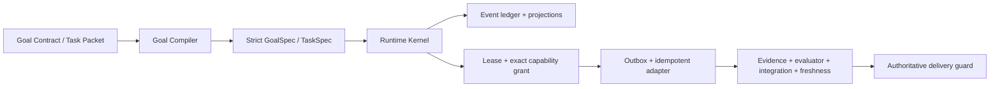

# CompanyOS

CompanyOS is a public-safe, single-host operating runtime for AI-native
software work. It combines human-readable Goal Contracts and Task Packets with
a code-enforced Runtime Kernel: durable events, explicit state machines,
task-scoped capability grants, leases and fencing, a transactional outbox,
typed evidence, runtime freshness, integration/evaluation queues, scoped
context and memory, and guarded self-improvement proposals.

It is not the private COS source vault, a generic skill library, a
project-specific submodule, a distributed workflow engine, or proof of
provider/human/business acceptance. GFR is the authoring-to-runtime compiler
boundary inside CompanyOS. Codex is one adapter, not the repository identity.

## What Is Executable



The kernel is implemented in `companyos_runtime/`. The canonical wire
contracts are in `runtime/contracts/v1/runtime-contracts.schema.json`. The
architecture and operational limits are documented in:

- `docs/runtime-architecture.md`
- `docs/operations-runbook.md`

## Quick Start

Python 3.11 or newer is required.

```powershell
python -m pip install -e .
python -m companyos_runtime --db "$HOME/.company-os/state/runtime.db" init
python -m companyos_runtime validate --repo .
```

Run the complete zero-provider-cost crash/recovery slice:

```powershell
python -m companyos_runtime demo `
  --state-dir "$HOME/.company-os/demos/crash-recovery" `
  --fault-at after_effect_before_checkpoint
```

The demo creates a Goal/Run/Task, acquires a fenced lease, records a
maker-checker approval and exact zero-cost grant, performs one idempotent effect
against a separate fake-provider ledger, crashes before checkpoint, reconciles
the receipt, records independent runtime evidence and a fresh observation,
closes Integration Queue, verifies replay, and routes an improvement candidate
through held-in and isolated held-out evaluation. It stops at owner review.

Expected scoped claims:

```text
run_state = delivered
task_state = delivered
external_effect_delta = 1
evidence_state = runtime_verification
improvement_state = owner_review
provider_cost = 0
```

It does not claim provider smoke, human acceptance, business/legal validation,
public release, active-rule promotion, or multi-host exactly-once behavior.

## Runtime Invariants

- Goal/Task authority is strict and segment-safe; TaskSpec must be a subset of
  GoalSpec.
- Run transitions are event driven; direct LoopState mutation is rejected.
- Delivery guards are computed from persisted evidence, evaluator,
  Integration Queue, and fresh observations. Caller booleans are not authority.
- Approvals require different maker/checker principals. Grants bind principal,
  task, capability, action, resource, request digest, expiry, use count, budget,
  and optional fencing token. Approval, issue, and consume also recheck that the
  exact resource remains inside the persisted TaskSpec scope and outside every
  forbidden scope. Each capability has a closed action vocabulary, and
  approval/grant/consume obey capability-specific execution phases.
- Scheduler order is explicit: claim while the Run is ready, prove the exact
  lease holder/fence through the Run `task_started` event, then start the Task.
  Worker consumption also requires a current `task://<task_id>` claim; stale
  or terminal work cannot create a new external effect. Enqueue preflights the
  live holder and exact grant before reserving a declared workflow step.
- Event payloads are digest-verified and globally hash chained. Core
  Goal/Run/Task events also require a live authenticated session,
  event-specific role, and per-store opaque command capability bound to the
  exact RuntimeKernel or TaskScheduler instance; caller handler metadata is
  rejected. Projections can be replayed and checked.
- Synthetic evidence cannot be upgraded to provider, human, business, memory,
  or active-rule evidence.
- Context records selection and rejection. Memory promotion preserves evidence
  provenance, TTL, promotion-validation, and exact human approval.
- Active rule promotion is separate from durable memory promotion and is never
  automatic; active promotion also requires a sealed evaluation that was not
  used to select the candidate. Canonical readback verifies the full
  `ActiveRulePromotionRecord` and its proposal/eval/attestation/limited/approval
  event lineage in one transaction snapshot.

## Authoring and Compilation

Use these public-safe authoring templates:

```text
templates/AOS_STARTUP_PACKET.md
templates/GOAL_CONTRACT.md
templates/TASK_PACKET.md
templates/EVIDENCE_PACKET.md
templates/RUNTIME_SURFACE_VECTOR.md
```

Compile JSON authoring packets before execution:

```powershell
python -m companyos_runtime compile-goal --input goal-authoring.json
python -m companyos_runtime compile-task `
  --input task-authoring.json --goal-spec compiled-goal.json
```

Narrative fields such as worker preference, worktree choice, and handoff notes
remain contextual. Only the compiled spec is executable authority.
Each executable workflow step binds `step_id`, adapter, action, resource, and
the SHA-256 digest of the exact request; enqueue and dispatch both revalidate
that persisted declaration.

## Local CLI

```powershell
# Redacted counts and one run projection
python -m companyos_runtime --db .state/runtime.db status --run-id run-1

# Hash chain plus deterministic core replay
python -m companyos_runtime --db .state/runtime.db verify

```

Mutating runtime commands, outbox recovery, and projection repair are not
exposed as unauthenticated CLI surfaces in v0.2. An embedding application must
authenticate an opaque session and invoke the relevant Python service inside
the trusted kernel process.

The PowerShell compatibility adapter retains the old draft/log commands and
routes runtime validation to the Python kernel:

```powershell
.\bin\company-os.ps1 validate
.\bin\company-os.ps1 runtime-demo -StateDir "$HOME/.company-os/demos/demo-1"
.\bin\company-os.ps1 runtime-status
.\bin\company-os.ps1 runtime-verify
```

## Repository Layout

```text
companyos_runtime/    executable kernel and CLI
runtime/contracts/    canonical public wire contracts
core/                 authority and evidence doctrine
gfr/                  startup/compiler contract
full-stack/           engineering and release standards
templates/            human authoring packets
adapters/              runtime-specific guidance; Codex is one adapter
docs/                  architecture, operations, source sync, onboarding
tests/                 contract, concurrency, chaos, policy, evidence and eval tests
```

## Install Boundary

`install.ps1` and `install.sh` install only into a managed, marked directory.
They refuse recursive replacement of an unmarked path. Runtime state lives
outside the installed kit under `~/.company-os/state`; reinstalling code does
not authorize or erase unrelated project state.

Cloning or installing CompanyOS cannot alter every project on a machine. Each
project must opt in and compile its own Goal/Task authority. Remote repository
mutation, server writes, provider cost, destructive cleanup, public release,
human acceptance, legal/business decisions, and active-rule promotion always
remain separately gated.
