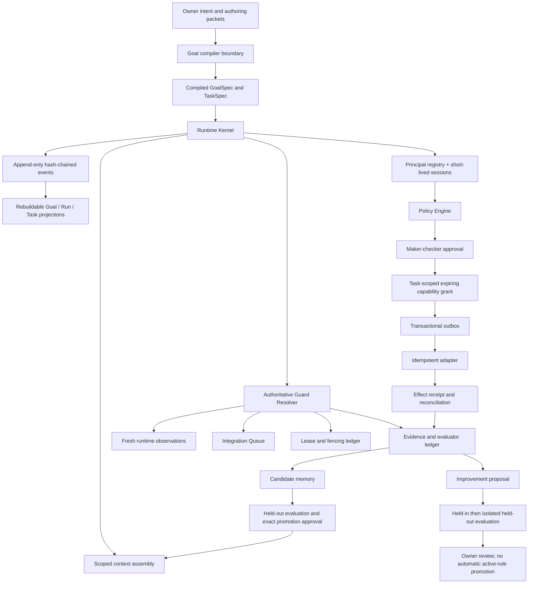

# CompanyOS Runtime Architecture v0.2 Draft

Status: implemented single-host kernel, pre-release. This document describes
the code-enforced runtime. It is not a claim that every project, provider,
server, or public release has been verified.

## Purpose

CompanyOS turns the useful parts of Agentic Operating System v1 from prose into
a durable control plane. Goal Contracts and Task Packets remain human-readable
authoring inputs; execution uses strict compiled `GoalSpec` and `TaskSpec`
objects. A thread, worker, evaluator, worktree, or automation is an execution
resource, not the source of truth.

The v0.2 implementation is deliberately single-host. SQLite WAL, an append-only
event ledger, monotonic fencing, task-scoped grants, a transactional outbox,
typed evidence, fresh observations, and explicit integration/evaluation queues
provide local durability. They do not provide distributed consensus or generic
exactly-once behavior for non-idempotent external systems.

## Control Architecture



## Authority Order

The executable order is:

1. explicit owner authority;
2. a live authenticated principal with the required role;
3. compiled GoalSpec authority and forbidden scopes;
4. compiled TaskSpec, which must be a subset of the GoalSpec;
5. a current task/resource lease and fencing token when concurrency matters;
6. an exact, live maker-checker approval;
7. an exact, expiring capability grant bound to principal, task, action,
   resource, request digest, budget, use count, and optional fence;
8. an idempotent command and durable effect receipt.

A broad conversational authorization is not stored as an unlimited wildcard.
The application boundary compiles it into bounded Goal/Task capabilities. An
effect cannot execute solely because a caller passes `true` for a guard.

The single-host identity boundary permits one trust-on-first-use owner bootstrap
only while the principal registry is empty. The owner creates role-bounded
principals. Privileged operations require short-lived bearer sessions that are
revalidated against persisted token digests, credential version, enabled state,
expiry, revocation, and current roles on every use. Credential and session
secrets are never stored in clear text or written to the event ledger. This is
local application authentication, not operating-system, hardware-backed, or
enterprise identity federation.

## Durable State and Replay

The event envelope contains aggregate identity/version, project/run/task,
actor and auth context, command/idempotency/correlation/causation identifiers,
policy version, event and record time, confidentiality, payload digest, the
previous global event hash, and the event hash. SQLite triggers reject event
updates and deletes. Aggregate versions are optimistic-concurrency checks.

Core Goal/Run/Task events are accepted only with a live bearer proof, matching
principal/session/role, event-specific role, and a per-store opaque command
capability bound to the exact RuntimeKernel or TaskScheduler instance. Caller
handler/session/role metadata is rejected and replaced by store-owned audit
metadata. Chain verification rechecks that provenance and that the referenced
session was valid at event time; a bearer or handler string alone cannot append
a core event. Python code able to reflect into or monkey-patch the trusted
kernel process remains inside the stated single-process TCB.

`ProjectionReplayer` verifies the hash chain, replays Goal/Run/Task state
transitions, compares replayed state with current projections, and lets an
authenticated `system` principal repair missing or corrupted core projections.
It refuses to silently delete extra rows that have no canonical event. Task
attempt counts, retry deadlines, and last-error fingerprints are cross-checked
against `attempts` and `negative_results` in the same transaction. Those and
the other secondary ledgers are mutable, non-hash-chained records: this check
detects internal disagreement but does not authenticate collusive tampering or
make them event-rebuildable. Repair therefore preserves consistent operational
fields and refuses to guess a missing task projection after execution history
or while any task-linked secondary row survives. Leases, grants, evidence,
observations, outbox receipts, context, memory, and evals remain durable source
tables with audit events being expanded during hardening.

## State Machines

The Goal projection has one honest state: `compiled`. It records an accepted,
immutable compiled `GoalSpec`; it does not pretend that Goal rows independently
move through ready, running, blocked, delivered, deleted, or retired. Executable
progress belongs to Run and Task objects. In particular, v0.2 does not define
how one or several Runs aggregate into a mutable Goal lifecycle, so delivery of
one Run must not be projected as delivery of the Goal.

The Run loop is event driven. Direct `LoopState -> LoopState` mutation is not a
public operation. Important Run states remain separate:

```text
intake -> compiled -> ready -> running
running -> suspended_for_input | evidence_pending | blocked_*
evidence_pending -> integration_pending | running
integration_pending -> ci_pending | deploy_dir_updated | delivered
deploy_dir_updated --service_restart_attempted--> runtime_check_pending
runtime_check_pending -> runtime_freshness_verified | runtime_stale
delivered -> improvement_pending -> delivered
```

Task `failed` is not terminal: it may move to `retry_pending`. Task deletion,
retirement, cancellation, and delivery remain explicit executable states.
Integration keeps
`deploy_dir_updated`, `service_restart_required`, `runtime_stale`,
`delete_pending`, and `retire_pending` separate so a merge or file copy cannot
masquerade as a fresh runtime.

## Authoritative Delivery Gate

Delivery is a conjunction of persisted facts:

```text
required evidence exists at the exact evidence level
AND required independent evaluator verdict passed
AND every declared executable workflow step durably succeeded
AND every required Integration Queue item is delivered or superseded
AND every required runtime surface has a current healthy probe
AND every declared Task is delivered (canceled/deleted/failed/retired do not count)
```

The Guard Resolver reads those ledgers inside the transition transaction. A
caller hint that contradicts durable state is rejected. Synthetic evidence can
prove only structure or runtime verification; it cannot become provider smoke,
human acceptance, or business validation. Markdown, README files, declared
state, and other documentation paths are rejected as runtime probes.

## Side Effects and Recovery

The execution order is `claim -> Run task_started guard -> Task start`; a worker
cannot start or consume authority while the Run remains merely `ready`. The
outbox flow is:

1. validate the exact declared workflow step and executable Run/Task state;
2. preflight the current principal/task claim and exact live grant without
   consuming it, then persist the effect intent and workflow step;
3. consume the exact capability grant idempotently while rechecking the closed
   capability/action vocabulary, current roles, TaskSpec scope/forbidden scope,
   lifecycle, live worker task claim, and any required resource fence;
4. call an adapter with the effect idempotency key;
5. persist the provider receipt, result digest, outbox state, and step result in
   one transaction;
6. reconcile pending effects after restart.

Terminal Tasks and delivered/improvement-pending Runs are sealed against new
effects. A provider receipt that predates sealing may still be reconciled and
checkpointed because that branch performs no new external action.

The bundled fake provider is a separate SQLite database that behaves like an
external idempotent service. Fault points before the effect, after the effect
but before checkpoint, and after checkpoint demonstrate replay behavior. The
test proves one external fake effect for one key. A real adapter must expose an
idempotency key or a reconciliation API before making the same claim.

Negative results are retained by stable fingerprint with recurrence count and
repair route. They are not erased when a retry later succeeds.

## Context and Memory Lifecycle

Context items carry project, scope, source digest, classification, normative
status, priority, token estimate, effective time, expiry, and supersession.
Assembly records both selected and rejected items. Candidate, expired,
future-effective, out-of-scope, private/confidential/secret, and superseded
instructions do not enter the active context pack.

Memory starts as a candidate derived from typed evidence. Promotion is only:

```text
candidate -> limited -> active
```

Each promotion binds evidence/artifact provenance, candidate digest, an
isolated held-out passing evaluation with zero safety failures, and an exact
human approval carrying `durable_memory_promotion`. Memory promotion is not
active-rule promotion.

## Self-Improvement Boundary

The runtime may propose changes only on an allowlist such as prompt candidates,
context selection, workflow parameters, evaluator thresholds, routing
candidates, and memory candidates. Authority order, capability policy, event
integrity, held-out datasets, evaluator code, security policy, and secrets are
protected surfaces.

A candidate uses three partitions: discovery/held-in, promotion-validation
(`held_out` in the v0.2 wire name), and sealed test. Repeated promotion decisions
make the middle set adaptive validation, not a final test. A candidate must pass
discovery and isolated promotion-validation before owner review and limited
rollout. Active promotion additionally requires a clean sealed evaluation plus
a separate exact approval. The immutable `ActiveRulePromotionRecord` binds the
candidate/policy, promotion-validation query snapshot, limited record,
distinct maker/evaluator/owner principals, sealed eval and attestation, zero
safety failures, exact approval, scope, review/non-goals, rollback, and
non-claim boundary. Readback first verifies the event chain and then
cross-checks proposal, eval, attestation, limited and both approval
events/projections in one database snapshot. Once a sealed result influences
another edit, that set is burned and must be replaced. The zero-cost demo stops
at `owner_review`; it does not promote an active rule.

## Security and Failure Model

The current design explicitly handles:

- unauthenticated identity strings, forged sessions, expired/revoked sessions,
  disabled principals, stale credential versions, and role shortfalls;
- caller-forged transition guards;
- task authority exceeding the parent goal;
- path segment confusion, encoded traversal, and forbidden-scope overlap;
- stale workers and stale fencing tokens;
- approval/grant expiry, revocation, budget/use exhaustion, and digest drift;
- duplicate commands and crash windows around external effects;
- append-only event tampering and projection drift;
- stale, unhealthy, identity-mismatched, contradictory, or document-based
  runtime observations;
- evidence-level inflation and cross-task artifact reuse;
- held-in/held-out leakage and safety-failure suppression;
- direct Integration Queue terminal-state seeding;
- memory/rule promotion conflation.

The first release does not solve compromised host administrators, malicious
SQLite library/process memory, hardware-backed credential custody, identity
federation, distributed split-brain, non-idempotent provider APIs,
aggregate multi-run Goal lifecycle semantics, legal/business judgement, or
unattended public release. Those require separate controls and evidence.

## Runtime Surfaces and Project Isolation

Each project should model local checkout, remote repository, server deploy
directory, service manager, ports/processes, provider/tool gates, and runtime
health as separate surfaces. Fresh checks, not runtime documentation, close
drift. Worktrees/workers receive bounded write scope and close conditions.

## Evolution Path

The target progression is:

1. stabilize this single-host contract and event model;
2. add adapter conformance suites, policy/audit events, backup/restore drills,
   and bounded scheduler supervision;
3. integrate one non-critical real project read-only, then local-write only;
4. enable remote/server/provider capabilities one at a time with exact grants,
   budgets, reconciliation, and independent evaluation;
5. if multi-host execution becomes necessary, move orchestration to a durable
   workflow substrate or transactional service rather than stretching SQLite
   leases into a distributed-consensus claim.
